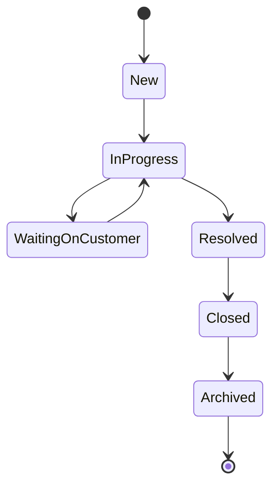

# API Documentation

## 1. Introduction

The NorthStar Ops Request Tracker API provides RESTful endpoints for managing operational requests and retrieving dashboard analytics. The API is built using FastAPI and follows standard REST principles.

The API supports:

* Request Creation
* Request Retrieval
* Request Updates
* Request Archiving (Soft Delete)
* Dynamic Filtering
* Dashboard Metrics

All responses are returned in JSON format.

---

# 2. API Overview

## Base URL

```text
http://localhost:8000
```

## Interactive API Documentation

FastAPI automatically generates Swagger documentation.

```text
http://localhost:8000/docs
```

## Content Type

All requests and responses use:

```http
Content-Type: application/json
```

---

# 3. Request Lifecycle

Requests move through different operational states during their lifecycle.



### Status Definitions

| Status              | Description                                   |
| ------------------- | --------------------------------------------- |
| New                 | Newly created request                         |
| In Progress         | Request currently being processed             |
| Waiting on Customer | Additional information required from customer |
| Resolved            | Request successfully completed                |
| Closed              | Request officially closed                     |
| Archived            | Soft deleted request                          |

---

# 4. Request Management APIs

---

## 4.1 Get All Requests

### Endpoint

```http
GET /requests
```

### Description

Retrieves request records from the system.

By default, only active (non-archived) requests are returned.

This endpoint also supports dynamic filtering.

### Query Parameters

| Parameter      | Type    | Required | Description            |
| -------------- | ------- | -------- | ---------------------- |
| country        | string  | No       | Filter by country      |
| category       | string  | No       | Filter by category     |
| priority       | string  | No       | Filter by priority     |
| status         | string  | No       | Filter by status       |
| assigned_owner | string  | No       | Filter by owner        |
| archived       | boolean | No       | View archived requests |
| overdue        | boolean | No       | View overdue requests  |

### Example Request

```http
GET /requests
```

### Example Filtered Request

```http
GET /requests?country=Canada&priority=Urgent
```

### Success Response

```json
[
  {
    "request_id": "REQ-1002",
    "customer_name": "Andre Brooks",
    "country": "Canada",
    "priority": "Urgent",
    "status": "In Progress"
  }
]
```

### Business Logic

The endpoint dynamically builds SQLAlchemy queries based on the provided query parameters.

Archived records are excluded unless explicitly requested.

---

## 4.2 Create Request

### Endpoint

```http
POST /requests
```

### Description

Creates a new request record.

The system automatically generates a unique Request ID.

### Request Body

```json
{
  "customer_name": "John Doe",
  "email": "john@example.com",
  "country": "United States",
  "timeZone": "Eastern",
  "category": "Technical Issue",
  "priority": "High",
  "status": "New",
  "assigned_owner": "Ops Agent 1",
  "due_date": "2026-07-15",
  "notes": "Unable to access dashboard"
}
```

### Success Response

```json
{
  "message": "Request created successfully",
  "request_id": "REQ-1026"
}
```

### Business Logic

A unique request identifier is generated automatically.

Example:

```text
REQ-1001
REQ-1002
REQ-1003
```

The request is stored with creation and update timestamps.

---

## 4.3 Get Request By ID

### Endpoint

```http
GET /requests/{request_id}
```

### Description

Retrieves a specific request using its unique Request ID.

### Example Request

```http
GET /requests/REQ-1001
```

### Success Response

```json
{
  "request_id": "REQ-1001",
  "customer_name": "Maya Thompson",
  "priority": "High",
  "status": "New"
}
```

### Error Response

```json
{
  "detail": "Request not found"
}
```

---

## 4.4 Update Request

### Endpoint

```http
PATCH /requests/{request_id}
```

### Description

Partially updates an existing request.

Only supplied fields are updated.

### Example Request

```json
{
  "priority": "Urgent",
  "status": "In Progress",
  "assigned_owner": "Ops Agent 2"
}
```

### Success Response

```json
{
  "message": "Request updated successfully",
  "request_id": "REQ-1001"
}
```

### Business Logic

PATCH is used instead of PUT because only modified fields are updated.

The updated_at timestamp is automatically refreshed.

---

## 4.5 Archive Request

### Endpoint

```http
DELETE /requests/{request_id}
```

### Description

Archives a request using a soft-delete strategy.

Records are preserved in the database.

### Example Request

```http
DELETE /requests/REQ-1001
```

### Success Response

```json
{
  "message": "Request archived successfully",
  "request_id": "REQ-1001"
}
```

### Business Logic

Instead of deleting the record:

```python
is_archived = True
```

This preserves historical information.

---

# 5. Dashboard Metrics API

---

## 5.1 Get Dashboard Metrics

### Endpoint

```http
GET /metrics
```

### Description

Returns analytics and dashboard statistics.

### Success Response

```json
{
  "total_requests": 25,
  "open_requests": 14,
  "urgent_requests": 5,
  "overdue_requests": 2,

  "requests_by_country": {
    "United States": 13,
    "Canada": 12
  },

  "requests_by_category": {
    "Technical Issue": 6,
    "Billing": 5
  },

  "requests_by_priority": {
    "Urgent": 5,
    "High": 8
  },

  "requests_by_status": {
    "New": 9,
    "In Progress": 4
  }
}
```

---

# 6. Metrics Calculation Logic

## Total Requests

Counts all active requests.

Formula:

```text
is_archived = False
```

---

## Open Requests

Counts requests with statuses:

* New
* In Progress
* Waiting on Customer

---

## Urgent Requests

Counts requests where:

```text
priority = Urgent
```

---

## Overdue Requests

Counts requests where:

```text
due_date < current_date
```

---

## Country Analytics

Groups requests by country.

Uses SQLAlchemy aggregation functions.

---

## Category Analytics

Groups requests by category.

Uses SQLAlchemy aggregation functions.

---

# 7. Validation Rules

The API uses Pydantic schemas for request validation.

## Create Request Validation

Required fields:

* customer_name
* email
* country
* category
* priority
* status
* assigned_owner

---

## Email Validation

Valid:

```text
john@example.com
```

Invalid:

```text
john
```

---

## Date Validation

The due_date field must contain a valid date.

Example:

```text
2026-07-15
```

---

# 8. Error Handling

The API returns structured JSON error responses.

## Resource Not Found

HTTP 404

```json
{
  "detail": "Request not found"
}
```

---

## Validation Error

HTTP 422

```json
{
  "detail": [
    {
      "msg": "value is not a valid email address"
    }
  ]
}
```

---

## Internal Server Error

HTTP 500

```json
{
  "detail": "Internal server error"
}
```

---

# 9. HTTP Status Codes

| Status Code | Meaning               |
| ----------- | --------------------- |
| 200         | Request Successful    |
| 201         | Resource Created      |
| 400         | Bad Request           |
| 404         | Resource Not Found    |
| 422         | Validation Error      |
| 500         | Internal Server Error |

---

# 10. Example End-to-End Workflow

### Create Request

```http
POST /requests
```

↓

Request Created

↓

Generated ID:

```text
REQ-1026
```

↓

### View Request

```http
GET /requests/REQ-1026
```

↓

### Update Request

```http
PATCH /requests/REQ-1026
```

↓

Status:

```text
In Progress
```

↓

### Resolve Request

```text
Resolved
```

↓

### Archive Request

```http
DELETE /requests/REQ-1026
```

↓

Soft Deleted

```text
is_archived = True
```

---

# 11. Conclusion

The NorthStar Ops Request Tracker API provides a RESTful interface for managing operational requests, generating business metrics, and supporting dashboard analytics. The API follows modern FastAPI practices, uses Pydantic validation, SQLAlchemy ORM integration, and PostgreSQL persistence to ensure maintainability and scalability.
