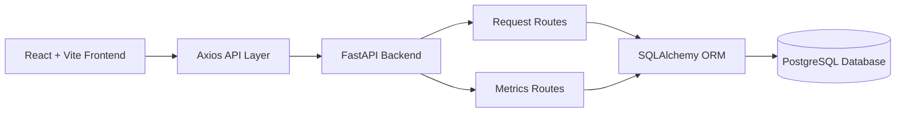
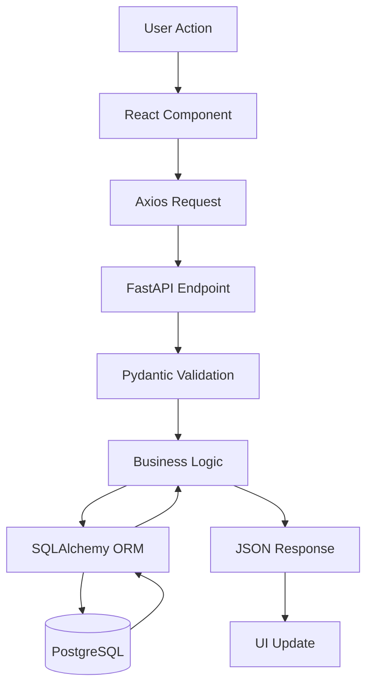
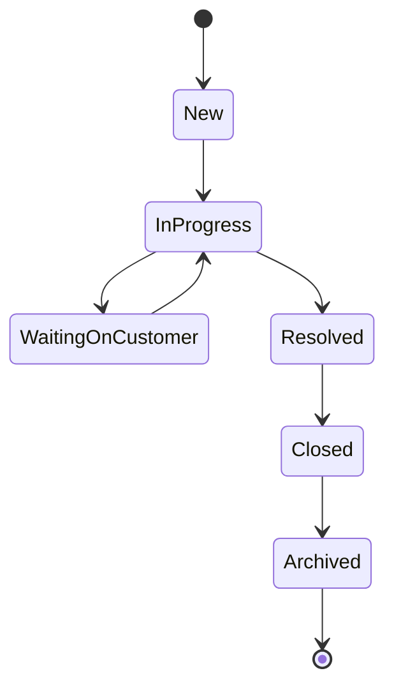

# Architecture Explanation

## System Overview

NorthStar Ops Request Tracker is a full-stack web application designed to help operations teams manage customer and lead requests through a centralized dashboard. The application provides request lifecycle management, filtering capabilities, analytics dashboards, and soft-delete archiving functionality.

The system follows a three-layer architecture:

1. Presentation Layer (React Frontend)
2. Application Layer (FastAPI Backend)
3. Data Layer (PostgreSQL Database)

This architecture promotes separation of concerns, maintainability, scalability, and ease of testing.

---

## High-Level System Architecture



### Architecture Description

The React frontend serves as the user interface and communicates with backend APIs using Axios. FastAPI handles request validation, business logic, filtering, and metrics generation. SQLAlchemy ORM acts as the data access layer and communicates with PostgreSQL for persistent storage.

---

## Backend Request Processing Flow



### Flow Description

When a user performs an action such as creating or updating a request, the frontend sends an HTTP request to the backend. FastAPI validates incoming data using Pydantic schemas. Business logic is executed, SQLAlchemy performs database operations, and the response is returned as JSON to the frontend.

---

## Backend Class Diagram

```mermaid
classDiagram

class Request {
    +String request_id
    +String customer_name
    +String email
    +String country
    +String timeZone
    +String category
    +String priority
    +String status
    +String assigned_owner
    +Date due_date
    +Text notes
    +DateTime created_at
    +DateTime updated_at
    +Boolean is_archived
}

class RequestCreate
class RequestUpdate

class RequestRoutes {
    GET /requests
    POST /requests
    GET /requests/{id}
    PATCH /requests/{id}
    DELETE /requests/{id}
}

class MetricsRoutes {
    GET /metrics
}

RequestRoutes --> Request
MetricsRoutes --> Request

RequestCreate --> Request
RequestUpdate --> Request
```

---

## Request Lifecycle



---

## Design Decisions

### FastAPI

FastAPI was selected because it provides:

* High performance
* Automatic Swagger documentation
* Strong validation through Pydantic
* Modern Python development experience

### PostgreSQL

PostgreSQL was chosen because:

* It is a robust relational database
* Supports complex filtering and aggregation
* Well suited for operational tracking systems

### SQLAlchemy ORM

SQLAlchemy provides:

* Database abstraction
* Query construction
* ORM-based model management
* Maintainable database interactions

### Soft Delete Strategy

Requests are archived rather than permanently deleted.

Instead of removing records:

```python
is_archived = True
```

This preserves historical data and supports future audit requirements.

---

## Scalability Considerations

Future improvements may include:

* Authentication and Authorization
* Role-Based Access Control
* AI Request Response Automation
* Pagination
* Audit Logging
* Docker Deployment
* CI/CD Pipelines
* Background Job Processing
* Cloud Deployment

