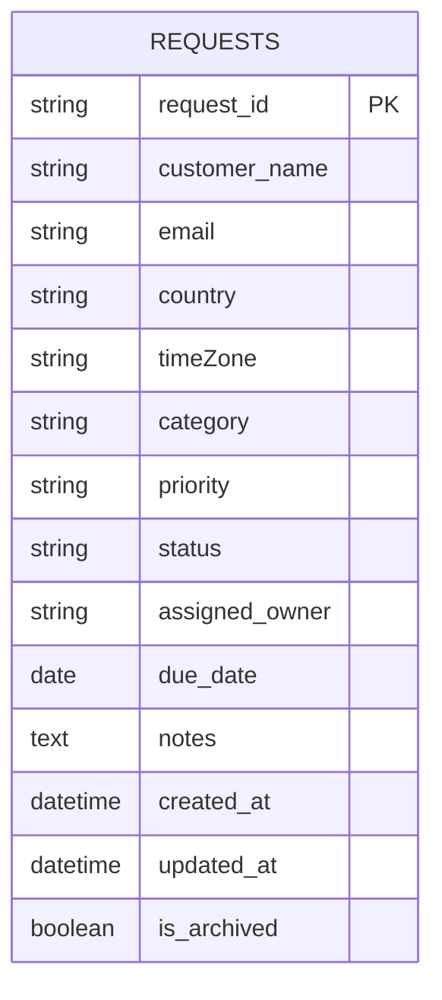
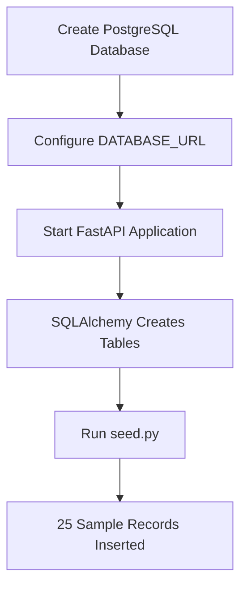

# Database Schema and Seed Data Instructions

## Database Overview

The application uses PostgreSQL as the primary relational database.

Database Name:

```text
northstar_ops
```

---

# Entity Relationship Diagram



---

# Table Schema

## requests

| Column         | Type      | Description               |
| -------------- | --------- | ------------------------- |
| request_id     | VARCHAR   | Unique request identifier |
| customer_name  | VARCHAR   | Customer name             |
| email          | VARCHAR   | Customer email            |
| country        | VARCHAR   | Customer country          |
| timeZone       | VARCHAR   | Customer timezone         |
| category       | VARCHAR   | Request category          |
| priority       | VARCHAR   | Priority level            |
| status         | VARCHAR   | Request status            |
| assigned_owner | VARCHAR   | Assigned owner            |
| due_date       | DATE      | Due date                  |
| notes          | TEXT      | Additional notes          |
| created_at     | TIMESTAMP | Creation timestamp        |
| updated_at     | TIMESTAMP | Last update timestamp     |
| is_archived    | BOOLEAN   | Soft delete flag          |

---

# PostgreSQL Schema Definition

The following SQL script can be executed directly in pgAdmin 4 or PostgreSQL Query Tool to create the database schema manually.

## Create Database

```sql
CREATE DATABASE northstar_ops;
```

Connect to the database and execute:

```sql
CREATE TABLE requests (

    request_id VARCHAR(20) PRIMARY KEY,

    customer_name VARCHAR(100) NOT NULL,

    email VARCHAR(255) NOT NULL,

    country VARCHAR(100) NOT NULL,

    timeZone VARCHAR(100) NOT NULL,

    category VARCHAR(100) NOT NULL,

    priority VARCHAR(20) NOT NULL,

    status VARCHAR(50) NOT NULL,

    assigned_owner VARCHAR(100) NOT NULL,

    due_date DATE,

    notes TEXT,

    created_at TIMESTAMP NOT NULL DEFAULT CURRENT_TIMESTAMP,

    updated_at TIMESTAMP NOT NULL DEFAULT CURRENT_TIMESTAMP,

    is_archived BOOLEAN NOT NULL DEFAULT FALSE
);
```

---

## Verify Table Creation

```sql
SELECT *
FROM information_schema.tables
WHERE table_name = 'requests';
```

---

## View Table Structure

```sql
SELECT
    column_name,
    data_type
FROM information_schema.columns
WHERE table_name = 'requests';
```

---

# Sample Seed Records

The following sample records can be inserted directly into PostgreSQL for testing purposes.

```sql
INSERT INTO requests (
    request_id,
    customer_name,
    email,
    country,
    timeZone,
    category,
    priority,
    status,
    assigned_owner,
    due_date,
    notes,
    created_at,
    updated_at,
    is_archived
)
VALUES

(
    'REQ-1001',
    'Maya Thompson',
    'maya@example.com',
    'United States',
    'Eastern',
    'Sales Lead',
    'High',
    'New',
    'Ops Agent 1',
    '2026-07-15',
    'Sample seeded request',
    CURRENT_TIMESTAMP,
    CURRENT_TIMESTAMP,
    FALSE
),

(
    'REQ-1002',
    'Andre Brooks',
    'andre@example.com',
    'Canada',
    'Atlantic',
    'Technical Issue',
    'Urgent',
    'In Progress',
    'Ops Agent 2',
    '2026-07-18',
    'Unable to access dashboard',
    CURRENT_TIMESTAMP,
    CURRENT_TIMESTAMP,
    FALSE
),

(
    'REQ-1003',
    'Lena Carter',
    'lena@example.com',
    'United States',
    'Central',
    'Billing',
    'Medium',
    'Waiting on Customer',
    'Ops Agent 1',
    '2026-07-20',
    'Invoice clarification required',
    CURRENT_TIMESTAMP,
    CURRENT_TIMESTAMP,
    FALSE
);
```

---

# Seed Script Approach

The project uses a Python seed script (`seed.py`) to automatically populate the database.

Run:

```bash
python seed.py
```

The script inserts 25 sample request records with:

* Multiple countries
* Multiple request categories
* Multiple priority levels
* Different request statuses
* Multiple assigned owners

This dataset is used to:

* Validate CRUD operations
* Test filtering functionality
* Generate dashboard analytics
* Demonstrate metrics calculations

---

# Database Initialization Workflow



---

# Example Queries

## View Active Requests

```sql
SELECT *
FROM requests
WHERE is_archived = FALSE;
```

## View Archived Requests

```sql
SELECT *
FROM requests
WHERE is_archived = TRUE;
```

## Count Requests By Country

```sql
SELECT
    country,
    COUNT(*)
FROM requests
GROUP BY country;
```

## Count Requests By Status

```sql
SELECT
    status,
    COUNT(*)
FROM requests
GROUP BY status;
```

## Count Requests By Priority

```sql
SELECT
    priority,
    COUNT(*)
FROM requests
GROUP BY priority;
```

# Schema Design Notes

## Soft Delete Strategy

Archived requests are not physically deleted.

Instead:

```python
is_archived = True
```

This preserves historical information while hiding archived records from normal queries.

---

## Request ID Generation

Request IDs are automatically generated.

Format:

```text
REQ-1001
REQ-1002
REQ-1003
```

This provides human-readable identifiers for operations teams.

---

## Metrics Aggregation

Dashboard metrics are generated dynamically using SQLAlchemy aggregation queries.

Metrics include:

* Total Requests
* Open Requests
* Urgent Requests
* Overdue Requests
* Requests by Country
* Requests by Category
* Requests by Priority
* Requests by Status

---

# Seed Data

The project includes a seed script.

Purpose:

* Populate database with sample records
* Enable dashboard testing
* Validate filtering functionality
* Demonstrate metrics calculations

---

# Running Seed Script

Execute:

```bash
python seed.py
```

This inserts 25 sample request records.

Sample data includes:

* Multiple countries
* Multiple categories
* Different priorities
* Different statuses
* Different assigned owners

---

# Example Seed Record

```json
{
  "request_id": "REQ-1001",
  "customer_name": "Maya Thompson",
  "email": "maya@example.com",
  "country": "United States",
  "timeZone": "Eastern",
  "category": "Sales Lead",
  "priority": "High",
  "status": "New",
  "assigned_owner": "Ops Agent 1"
}
```

---

# Database Setup

Create database:

```sql
CREATE DATABASE northstar_ops;
```

Configure environment variable:

```env
DATABASE_URL=postgresql://postgres:<password>@localhost:5432/northstar_ops
```

Run application:

```bash
uvicorn main:app --reload
```

Tables are automatically created using SQLAlchemy metadata.
